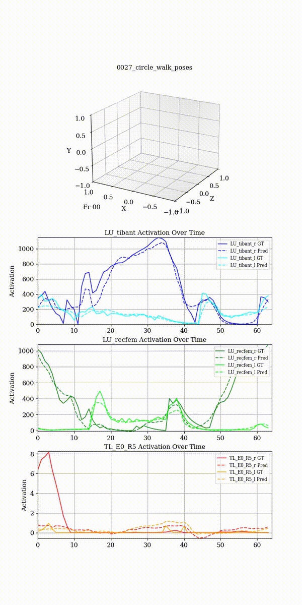
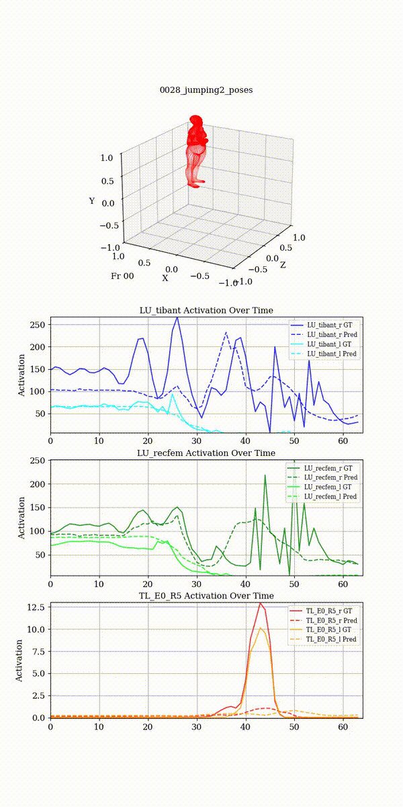
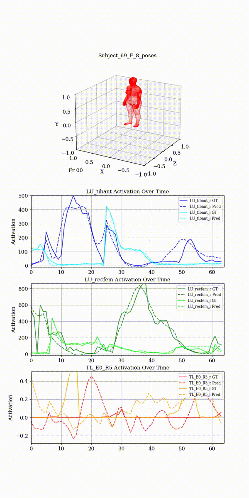
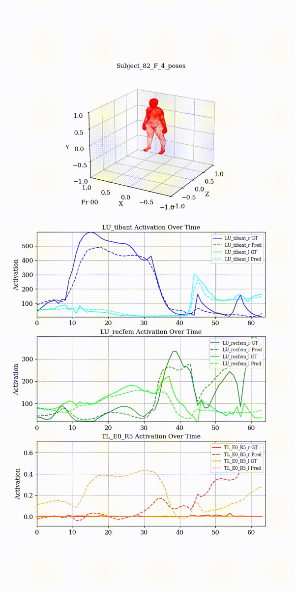

# Motion to Muscle Mapping with TransGCN
This work is adapted from the official pytorch implementation of the paper "[MotionAGFormer: Enhancing 3D Human Pose Estimation With a Transformer-GCNFormer Network](https://openaccess.thecvf.com/content/WACV2024/html/Mehraban_MotionAGFormer_Enhancing_3D_Human_Pose_Estimation_With_a_Transformer-GCNFormer_Network_WACV_2024_paper.html)" (WACV 2024).

## Environment
The project is developed under the following environment:
- Python 3.12
- PyTorch 2.6.0
- CUDA 12.8

For installation of the project dependencies, please run:
```
pip install -r requirements.txt
``` 
## Dataset
1. Download the Muscles in Time data at [MinT](https://davidschneider.ai/mint/)
2. Download the Archive of Motion Capture As Surface Shapes data at [AMASS](https://amass.is.tue.mpg.de/) for the following motion capture datasets which correspond to the ones used in MinT:
- [BML-MoVi and BML-RUB](https://www.biomotionlab.ca/movi/)
- [KIT Whole-Body Human Motion Database](https://motion-database.humanoids.kit.edu/)
- [EyesJapan Dataset](http://mocapdata.com/Terms_of_Use.html)
- [Total Capture](https://cvssp.org/data/totalcapture/)
3. Organize all motion capture datasets under a central `dataset/` folder. Each motion capture dataset folder contains two subfolders:
- `motion/`: Contains the corresponding AMASS motion capture files (.npz) of subjects.
- `muscle/`: Contains the corresponding MinT muscle activation files (.pkl) of subjects.
4. For body mesh visualization, download [SMPL-X](https://smpl-x.is.tue.mpg.de/) body models.

## Training

Select a model name in `lstm`, `lstm0`, `transformer` and `TransGCN`. You can optionally choose to use [weight and biases](wandb.ai). Use the following command:

```text
python train_mm.py --model_name <MODEL NAME> --use-wandb
```

## Inference and Visualization
Run the following command:
```text
python train_mm.py --eval-only --checkpoint <PATH TO YOUR CHECKPOINT FOLDER>  --checkpoint-file <CHECKPOINT FILE NAME>
```
This should create a mp4 files within the `output` directory.


### Demo

Example prediction output for selected muscle segments (Tibialis Anterior, Rectus Femoris, External Obliques):

<p align="center">
  
  
  
  
</p>


## Acknowledgement
Our code refers to the following repositories:

- [MotionAGFormer](https://github.com/TaatiTeam/MotionAGFormer)
- [MotionBERT](https://github.com/Walter0807/MotionBERT)
- [P-STMO](https://github.com/paTRICK-swk/P-STMO)
- [MHFormer](https://github.com/Vegetebird/MHFormer)

We thank the authors for releasing their codes.
